# atl.wiki Mediawiki Configs

> [!WARNING]
> Currently this is hardcoded for atl.wiki, in our next release we aim to create a base Mediawiki image that can be easily customized for other deployments seperate from our own images.
>
> **We do not reccomend using this for your own deployments at this time but we welcome any feedback or contributions.**

This repository contains Mediawiki configurations used for the deployment of [atl.wiki](https://atl.wiki). Including Docker configurations, environment settings, and other necessary files to run Mediawiki in a containerized environment with scripts to aid in the deployment and running of the application.

# Deployment Instructions
*These are currently just a basic overview, more detailed instructions will be added with the refactor in the next release.*

1. Install the dependencies on your server or local machine:
   - [Docker](https://docs.docker.com/get-docker/)
   - [Docker Compose](https://docs.docker.com/compose/install/)
   - [just](https://github.com/casey/just)

2. Clone this repository, we reccomend cloning the repository to `/opt/mediawiki`
```bash
    git clone https://github.com/allthingslinux/atl.wiki-configs mediawiki
```

3. Navigate to the cloned directory
```bash
    cd /opt/mediawiki
```

4. Run the file setup scripts, switch {ENV} with local, staging or prod.
```bash
    just {ENV}-files
```

5. Fill out the `.env` file as required with the values explained below.

6. Start the Mediawiki instance
```bash
    just start
```

7. Initialize the Mediawiki instance
```bash
    just mediawiki-init
```

8. Access the Mediawiki instance in your web browser at `https://{localhost:3000 | domain.tld}`

# Environment Variables

<insert table here later>

# Project Overview

### Directory Diagram

```mermaid
graph LR
    ComposeExample["📄 compose.yml.example"]
    EnvExample["📄 .env.example"]
    Deployment["📁 deployment/"]

    ComposeExample --- Deployment
    EnvExample --- Deployment

    ComposerJson["📦 composer.json"]
    ComposerLocal["📦 composer.local.json"]
    DefaultConf["⚙️ default.conf"]
    ExtensionsJson["🔌 extensions.json"]
    InstallPy["🐍 install_extensions.py"]
    LocalSettings["⚙️ LocalSettings.php"]
    MediawikiConf["⚙️ mediawiki.conf"]
    PhpIni["⚙️ php.ini"]
    Robots["🤖 robots.txt"]
    Configs["📁 configs/"]
    Wiki["📁 wiki/"]

    ComposerJson --- Wiki
    ComposerLocal --- Wiki
    DefaultConf --- Wiki
    ExtensionsJson --- Wiki
    InstallPy --- Wiki
    LocalSettings --- Wiki
    MediawikiConf --- Wiki
    PhpIni --- Wiki
    Robots --- Wiki
    Configs --- Wiki

    Root["📖 atl.wiki-configs"]

    Deployment --- Root
    Wiki --- Root

    Root --- Dockerfile["🐳 Dockerfile"]
    Root --- Justfile["⚙️ Justfile"]
    Root --- Just["📁 just/"]
    Root --- Systemd["📁 systemd/"]

    style Root fill:#e1f5ff
    style Deployment fill:#fff4e1
    style Just fill:#e8f5e9
    style Systemd fill:#f3e5f5
    style Wiki fill:#fff9c4
    style Configs fill:#ffebee
```



### Directory Map

| Path | Description |
|------|-------------|
| `deployment/` | Configuration templates for deployments (env and compose files) |
| `deployment/compose.yml.example` | Docker Compose configuration template (environment specific versions) |
| `deployment/env.example` | Environment variables template (environment specific versions) |
| `wiki/` | MediaWiki and NGINX application configurations |
| `wiki/composer.json` | PHP dependencies for MediaWiki extensions |
| `wiki/composer.local.json` | Local PHP dependency overrides for environment setup |
| `wiki/default.conf` | Not important, just exists because of NGINX quirk |
| `wiki/extensions.json` | MediaWiki extension manifest |
| `wiki/install_extensions.py` | Python script for extension installation |
| `wiki/LocalSettings.php` | MediaWiki configuration file which loads config modules in `wiki/configs/` |
| `wiki/mediawiki.conf` | MediaWiki NGINX configurations |
| `wiki/php.ini` | PHP runtime configuration |
| `wiki/robots.txt` | Crawler instructions |
| `wiki/.well-known/security.txt` | Security reporting instructions |
| `wiki/configs/` | Numbered configuration modules (00-99) ensuring correct load order |
| `Dockerfile` | MediaWiki container build configuration |
| `Justfile` | Main task runner entry point for Just scripts in `just/` |
| `just/` | Modular task automation recipes for operations and setup |
| `systemd/` | Automated maintenance tasks service and timer files |

# License

Copyright 2025 All Things Linux and Contributors

Primary maintainer: Atmois <atmois@allthingslinux.org>

Licensed under the Apache License, Version 2.0 (the "License");
you may not use this file except in compliance with the License.
You may obtain a copy of the License at
    http://www.apache.org/licenses/LICENSE-2.0

# Upstream Dependencies

We gratefully acknowledge the use of the following projects which are incorporated in or used by this project:

| Project | Link | License |
|---------|------|---------|
| Docker | https://www.docker.com | Apache-2.0 |
| Docker Compose | https://github.com/docker/compose | Apache-2.0 |
| Hadolint | https://github.com/hadolint/hadolint | GPL-3.0 |
| just | https://github.com/casey/just | CC0-1.0 |
| MediaWiki | https://www.mediawiki.org | GPL-2.0-or-later |
| PHP | https://www.php.net | PHP-3.01 |
| phpdotenv | https://github.com/vlucas/phpdotenv | BSD-3-Clause |
| Python | https://www.python.org | PSF-2.0 |
| Renovate | https://www.mend.io/renovate | AGPL-3.0 |
