# atl.wiki Mediawiki Configs

> [!WARNING]
> Currently this is hardcoded for atl.wiki, in our next release we aim to create a base Mediawiki image that can be easily customized for other deployments seperate from our own images.
>
> **We do not recommend using this for your own deployments at this time but we welcome any feedback or contributions.**

This repository contains Mediawiki configurations used for the deployment of [atl.wiki](https://atl.wiki). Including Docker configurations, environment settings, and other necessary files to run Mediawiki in a containerized environment with scripts to aid in the deployment and running of the application.

# Deployment Instructions
*These are currently just a basic overview, more detailed instructions will be added with the refactor in the next release.*

> [!NOTE]
> **This only applies if you are running a staging or production instance, local instances have these pre-configured as docker containers.** To deploy this service you will need:
> - A running and accessible [MariaDB](https://mariadb.org) server which is version 10.3 or higher, we reccomend having this either as a managed service or having a dedicated server running MariaDB.
> - A running and accessible S3 server or configured provider, we recommend [Cloudflare's R2 service](https://www.cloudflare.com/en-gb/developer-platform/products/r2/).

1. Install the dependencies on your server or local machine:
   - [Docker](https://docs.docker.com/get-docker/)
   - [git](https://git-scm.com/install/linux)
   - [Docker Compose](https://docs.docker.com/compose/install/)
   - [just](https://github.com/casey/just)

2. Clone this repository, we reccomend cloning the repository to `/opt/mediawiki`
```bash
    git clone https://github.com/allthingslinux/atl-wiki mediawiki
```

3. Navigate to the cloned directory
```bash
    cd /opt/mediawiki
```

4. Run the file setup scripts, switch {ENV} with local, staging or production.
```bash
    just {ENV}-files
```

5. Fill out the `.env` file as required with the values explained below.

6. Start the Mediawiki instance
```bash
    just start
```

7. Initialize the Mediawiki instance
```bash
    just mediawiki-init
```

8. Access the Mediawiki instance in your web browser at `https://{localhost:3000 | domain.tld}`

# Environment Variables

Variables marked with a `*` are required. The function they provide may be optional but the wiki may not operate correctly without the variables provided. For local setups **we recommend not changing the pre-defined values to ensure the containers can communicate properly**:

| Variable | Description      | Example |
|----------|------------------|---------|
| `MEDIAWIKI_MAJOR_VERSION` * | The major version number of MediaWiki you want to use | `1.44` |
| `MEDIAWIKI_VERSION` * | The full version number of MediaWiki you want to use | `1.44.2` |
| `MEDIAWIKI_BRANCH` * | The branch of MediaWiki you want to use for extensions | `REL1_44` |
| `CITIZEN_VERSION` * | The version of the Citizen skin you want to use | `3.11.0` |
| `UPGRADE_KEY` * | The key to access the upgrade page. Must be a 16-character alphanumeric string | *Generate using `openssl rand -hex 8`* |
| `SECRET_KEY` * | The key used for various security related functions within MediaWiki. Must be a 64-character alphanumeric string | *Generate using `openssl rand -hex 32`* |
| `DB_SERVER` * | The IP address or hostname of your database server | `db.example.com` or `192.168.0.0` |
| `DB_NAME` * | The name of the table in the database used by MediaWiki | `mediawiki` |
| `DB_USER` * | The username used by MediaWiki to connect to the database | `mediawiki` |
| `DB_PASSWORD` * | The password used by MediaWiki to connect to the database | `0123456789abcdef` |
| `SMTP_HOST` | The SMTP server host address | `smtp.gmail.com` |
| `SMTP_DOMAIN` | The SMTP domain you wish to use for sending emails | `example.com` |
| `SMTP_PORT` | The SMTP server port (usually 587 for TLS or 465 for SSL) | `587` |
| `SMTP_USERNAME` | The email address to send SMTP emails from for service notifications | `noreply@example.com` |
| `SMTP_PASSWORD` | The password for the SMTP username | `0123456789abcdef` |
| `EMERGENCY_EMAIL` | The email address to send emergency notifications to | `admin@example.com` |
| `TURNSTILE_SITE_KEY` * | The site key for Cloudflare Turnstile | `0123456789abcdef` |
| `TURNSTILE_SECRET_KEY` * | The secret key for Cloudflare Turnstile | `0123456789abcdef` |
| `OPENID_CLIENT_ID` | The client ID for OpenID authentication from Okta | `0123456789abcdef` |
| `OPENID_CLIENT_SECRET` | The client secret for OpenID authentication from Okta | `0123456789abcdef` |
| `S3_ENDPOINT` * | The S3 endpoint URL | `https://s3.domain.tld` |
| `S3_ACCESS_KEY_ID` * | The S3 access key ID | `0123456789abcdef` |
| `S3_SECRET_ACCESS_KEY` * | The S3 secret access key | `0123456789abcdef` |
| `S3_BUCKET_NAME` * | The S3 bucket name | `wiki-images` |
| `S3_BUCKET_DOMAIN` * | The S3 bucket domain | `wiki-images.domain.tld` |
| `SITENAME` * | The domain the wiki will be accessible from, without the protocol | `wiki.example.com` |
| `WG_SERVER` * | The full URL the wiki will be accessible from, including the protocol | `https://wiki.example.com` |
| `DISCORD_WEBHOOK_URL` * | Discord Webhook URL | `https://discord.com/api/webhooks/0123456789/abcdef` |

Below are the extra options for **LOCAL** setups.

| Variable* | Description      | Example |
|-----------|------------------|---------|
| `MARIADB_PASSWORD` * | The MariaDB root password. This needs to match `DB_PASSWORD` | `local-maria-password` |
| `MARIADB_NAME` * | The MariaDB database name. This needs to match `DB_NAME` | `local-maria-db` |
| `MARIADB_USER` * | The MariaDB username. This needs to match `DB_USER` | `local-maria-user` |
| `MINIO_USER` * | The MinIO username. This needs to match `S3_ACCESS_KEY_ID` | `local-minio-user` |
| `MINIO_PASSWORD` * | The MinIO password. This needs to match `S3_SECRET_ACCESS_KEY` | `local-minio-password` |

# Notes for System Administrators

- Please DO NOT modify your generated `compose.yml`, it will be overridden on any update and may cause unexpected behavior. The **only two supported exceptions** is changing the NGINX external port from `3000` or if you use an external database, cache or S3 provider where you can comment out the relevant service lines, but please be aware you will need to manage those services yourself AND it will still be overridden on updates.
- If possible avoid running `docker compose` commands directly, instead use the provided `just` commands to ensure proper operation. These are designed to handle checks and ensure smooth operation of the wiki deployment.
- Any changes to files in the `wiki/` directory will require a clean restart to take effect. Use `just clean-restart` to perform this action safely.
- To fully utilise the image you will require a host OS which utilises Systemd as its init system. You can still run without systemd but certain features will not be available.

## Project Overview

### Directory Diagram

```mermaid
graph LR
    ComposerJson["📦 composer.json"]
    ComposerLocal["📦 composer.local.json"]
    DefaultConf["⚙️ default.conf"]
    ExtensionsJson["🔌 extensions.json"]
    InstallPy["🐍 install_extensions.py"]
    LocalSettings["⚙️ LocalSettings.php"]
    MediawikiConf["⚙️ mediawiki.conf"]
    PhpIni["⚙️ php.ini"]
    Robots["🤖 robots.txt"]
    Configs["📁 configs/"]
    Wiki["📁 wiki/"]

    ComposerJson --- Wiki
    ComposerLocal --- Wiki
    DefaultConf --- Wiki
    ExtensionsJson --- Wiki
    InstallPy --- Wiki
    LocalSettings --- Wiki
    MediawikiConf --- Wiki
    PhpIni --- Wiki
    Robots --- Wiki
    Configs --- Wiki

    Root["📖 atl-wiki"]

    Deployment --- Root
    Wiki --- Root

    Root --- Dockerfile["🐳 Dockerfile"]
    Root --- Justfile["⚙️ Justfile"]
    Root --- ComposeExample["📄 compose.yml.example"]
    Root --- EnvExample["📄 .env.example"]
    Root --- Just["📁 just/"]
    Root --- Systemd["📁 systemd/"]

    style Root fill:#e1f5ff
    style Deployment fill:#fff4e1
    style Just fill:#e8f5e9
    style Systemd fill:#f3e5f5
    style Wiki fill:#fff9c4
    style Configs fill:#ffebee
```



### Directory Map

| Path | Description |
|------|-------------|
| `wiki/` | MediaWiki and NGINX application configurations |
| `wiki/composer.json` | PHP dependencies for MediaWiki extensions |
| `wiki/composer.local.json` | Local PHP dependency overrides for environment setup |
| `wiki/default.conf` | Not important, just exists because of NGINX quirk |
| `wiki/extensions.json` | MediaWiki extension manifest |
| `wiki/install_extensions.py` | Python script for extension installation |
| `wiki/LocalSettings.php` | MediaWiki configuration file which loads config modules in `wiki/configs/` |
| `wiki/mediawiki.conf` | MediaWiki NGINX configurations |
| `wiki/php.ini` | PHP runtime configuration |
| `wiki/robots.txt` | Crawler instructions |
| `wiki/.well-known/security.txt` | Security reporting instructions |
| `wiki/configs/` | Numbered configuration modules (00-99) ensuring correct load order |
| `compose.yml.example` | Docker Compose configuration template (environment specific versions available) |
| `env.example` | Environment variables template (environment specific versions available) |
| `Dockerfile` | MediaWiki container build configuration |
| `Justfile` | Main task runner entry point for Just scripts in `just/` |
| `just/` | Modular task automation recipes for operations and setup |
| `systemd/` | Automated maintenance tasks service and timer files |

# Just Commands
Before running any `just` commands, ensure you have read the `just help` command for important information and the dangers of certain commands.

| Command | Description |
|---------|-------------|
| `clean-restart` | Restart all wiki containers and removes cache volumes |
| `clean-stop` | Stop all wiki containers and removes cache volumes |
| `db-status` | Verify database connectivity for the wiki |
| `default` | Show available recipes |
| `health` | Check health status of all wiki containers |
| `help` | Display comprehensive help for all available commands |
| `local-files` | Setup local development environment files |
| `mediawiki-init` | Initialize MediaWiki database and create admin user |
| `mediawiki-schema-update` | Update MediaWiki database schema to latest version |
| `production-files` | Setup production environment files and configure sitemap service |
| `restart` | Restart all wiki containers |
| `sitemap-production` | Setup production sitemap generation as a systemd timer service |
| `sitemap-staging` | Setup staging sitemap generation as a systemd timer service |
| `staging-files` | Setup staging environment files and configure sitemap service |
| `start` | Start all wiki containers |
| `status` | Display comprehensive status of wiki deployment including containers, health, and database |
| `stop` | Stop all running wiki containers |
| `update` | Pull latest code, updates compose.yaml from template, and restarts wiki containers |

# License

Copyright 2025 All Things Linux and Contributors

Primary maintainer: Atmois <atmois@allthingslinux.org>

Licensed under the Apache License, Version 2.0 (the "License");
you may not use this project except in compliance with the License.
You may obtain a copy of the License at
    http://www.apache.org/licenses/LICENSE-2.0

# Upstream Dependencies

We gratefully acknowledge the use of the following projects which are incorporated in or used by this project:

| Project | Link | License |
|---------|------|---------|
| Docker | https://www.docker.com | Apache-2.0 |
| Docker Compose | https://github.com/docker/compose | Apache-2.0 |
| Hadolint | https://github.com/hadolint/hadolint | GPL-3.0 |
| just | https://github.com/casey/just | CC0-1.0 |
| MediaWiki | https://www.mediawiki.org | GPL-2.0-or-later |
| PHP | https://www.php.net | PHP-3.01 |
| PHP_CodeSniffer | https://github.com/PHPCSStandards/PHP_CodeSniffer/ | BSD3-Clause |
| phpdotenv | https://github.com/vlucas/phpdotenv | BSD-3-Clause |
| Python | https://www.python.org | PSF-2.0 |
| Renovate | https://www.mend.io/renovate | AGPL-3.0 |
